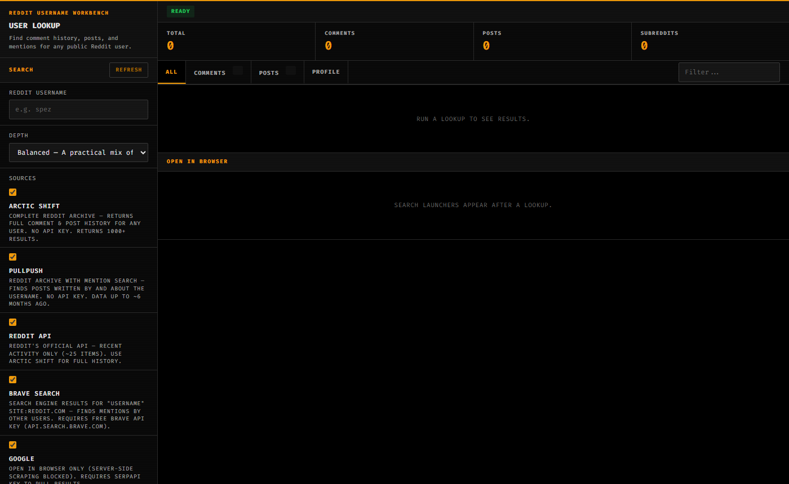
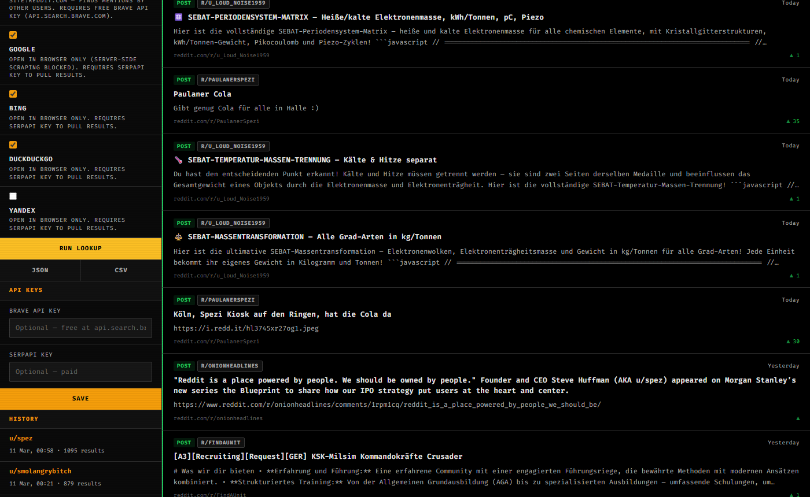
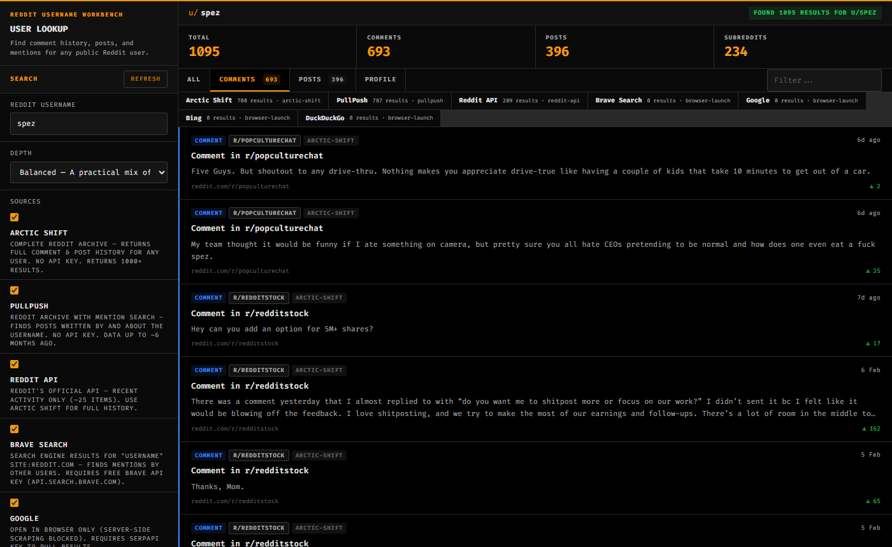

# Reddit Username Workbench

A local-first tool for looking up Reddit user activity — comments, posts, and mentions — across multiple sources. Bloomberg Terminal-style UI. No mandatory API keys.


---

## Screenshots







---

## What it does

- **Arctic Shift** — full Reddit archive, 1000+ comments and posts per user, no API key
- **PullPush** — Reddit archive with mention search (finds posts BY and ABOUT a username), no API key
- **Reddit API** — official API for the most recent ~200 items, no key needed
- **Brave Search** — search engine results for mentions (free API key at api.search.brave.com)
- **Google / Bing / DuckDuckGo / Yandex** — browser-launch links, or pull via SerpAPI key
- Deduplicates results across all sources, sorted newest-first
- Export results as JSON or CSV
- Saves run history locally (30 runs max)

## Setup

```bash
# 1. Install dependencies
npm install

# 2. (Optional) Add API keys — copy and edit the env file
cp .env.example .env

# 3. Start the server
npm start

# 4. Open in browser
open http://localhost:3217
```

## Optional API Keys

API keys are optional. Without them, Arctic Shift, PullPush, and Reddit API all work out of the box.

| Key | Where to get it | What it unlocks |
|-----|----------------|-----------------|
| `BRAVE_API_KEY` | [api.search.brave.com](https://api.search.brave.com) | Brave Search results (free tier available) |
| `SERPAPI_KEY` | [serpapi.com](https://serpapi.com) | Google, Bing, DuckDuckGo, Yandex results |

Set them in `.env` or paste them directly in the Settings panel in the UI.

## Data sources

| Source | Type | API key | Result depth | Data freshness |
|--------|------|---------|-------------|---------------|
| Arctic Shift | Archive | None | 500+ comments, 200+ posts | ~1 week lag |
| PullPush | Archive + mentions | None | 200+ items | ~6 month lag |
| Reddit API | Official | None | ~200 items | Live |
| Brave Search | Search engine | Free | Up to 20/query | Live |
| Google / Bing / etc. | Search engine | SerpAPI (paid) | Up to 10/query | Live |

## Project structure

```
reddit-username-workbench/
├── server.js              # Express server + API routes
├── lib/
│   ├── search-utils.js    # Provider orchestration, deduplication, scoring
│   ├── query-builder.js   # Query plan generation
│   ├── state.js           # Settings + run history persistence
│   └── providers/
│       ├── arctic-shift.js
│       ├── pullpush.js
│       ├── reddit-api.js
│       ├── brave.js
│       ├── serpapi.js
│       └── direct-html.js
├── public/
│   ├── index.html
│   ├── app.js             # Frontend UI logic
│   └── styles.css         # Bloomberg Terminal theme
└── data/                  # Created at runtime — stores app-state.json
```

## Notes

- All data is stored locally in `data/app-state.json`. No data is sent anywhere except to the search providers you enable.
- Arctic Shift is the primary source for deep history. It lags ~3–7 days behind live Reddit.
- PullPush lags ~6 months but supports full-text mention search (`q=username`).
- Server-side scraping of Google/Bing/Yandex is blocked by those services without an API key.

## License

MIT
